# EN.525.615 Laboratory 03
Dave Jansing  
Spring 2022

NOTE:  You will be responsible for writing a lab report for this laboratory.  You will modify the `lab_report.md` file in the `report` directory in your repository, putting any images, etc into the `media` directory.  Markdown cheat sheets can be found in the `supporting` directory.

- [EN.525.615 Laboratory 03](#en525615-laboratory-03)
  - [Lab Setup](#lab-setup)
    - [Accept the GitHub Classroom Assignment link](#accept-the-github-classroom-assignment-link)
    - [Clone Your Lab 3 Git Repository](#clone-your-lab-3-git-repository)
    - [Development Environment Updates](#development-environment-updates)
  - [Experiment 1:  Embedded Hello World](#experiment-1--embedded-hello-world)
    - [Project Creation](#project-creation)
    - [Hardware and the HAL API](#hardware-and-the-hal-api)
    - [Debugging and Running With QEMU](#debugging-and-running-with-qemu)
    - [User Control of the LED](#user-control-of-the-led)


## Lab Setup

### Accept the GitHub Classroom Assignment link

Now that you have a GitHub Account, you can accept the GitHub Classroom
Assignment for this Lab.

The GitHub Classroom Assignment for this Lab can be found [here](https://classroom.github.com/a/nee6vkq6).

### Clone Your Lab 3 Git Repository

This lab contains a minimum seed repository that is the same as the
previous labs. Clone the repository the same way that was done in the
previously.

### Development Environment Updates

In the Lab 3 Module on Blackboard, under the `QEMU ARM Update` section,  you will find an updated QEMU-ARM Package with the `NUCLEO-F103RB-TRAFFIC` model that is required for this lab.

* Download the version for the operating system you are using
* Extract the archive to a convenient location


TIP: You can follow the manual install process describe https://xpack.github.io/qemu-arm/install/#manual-install[HERE] if you want to follow the xPack QEMU Arm conventions


When you run/debug the application, you will need to tell STM32CubeIDE to use the updated QEMU application.

* In the Debug Configurations, Debugger Tab
** Click `Browse` in the `Executable path` area
** Locate `<extraction path>\bin\qemu-system-gnuarmeclipse`
*** Note the extension will vary based on OS

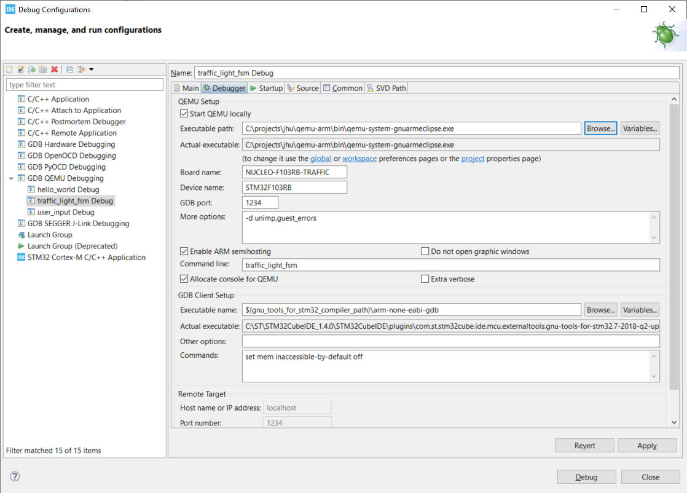

## Experiment 1:  Embedded Hello World

The most common *Hello World* equivalent for an embedded system is
blinking an LED. In this section, we will work through setting up the
project to target the **NUCLEO-F103RB** development board, update the code
to blink and LED and run the application on the QEMU Emulator for the
board.

**NOTE**:  The board you will receive is the P-NUCLEO-WB55 development board, which is different than the one you will use in this lab.  This lab uses the NUCLEO-F103RB because there is an emulator that allows for simulated interfacing, which we will take advantage of in this lab.

### Project Creation

-   Click File → New → STM32 Project

-   Click Board Selector

-   In Commercial Part Number Enter `NUCLEO-F103RB`

-   Click the Row for the `NUCLEO-F103RB` in the Board List area and
    then Click `Next`

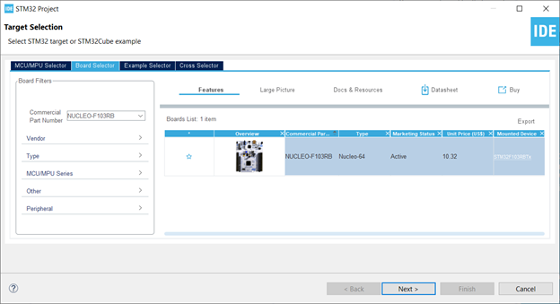

-   In the Project Name enter `hello_world`

-   Click `Next`

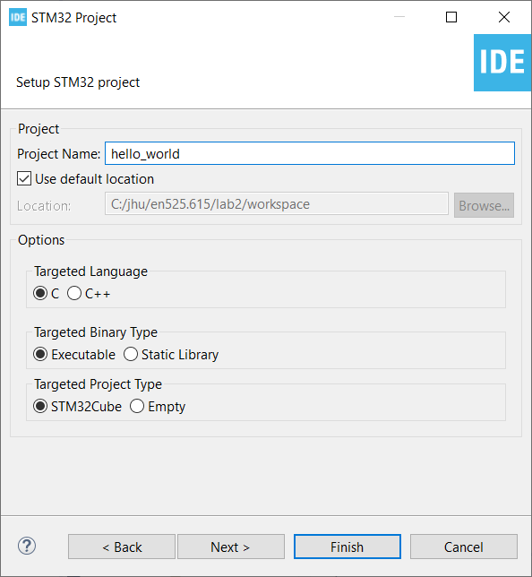

-   Ensure the latest Firmware is selected

-   Click Finish

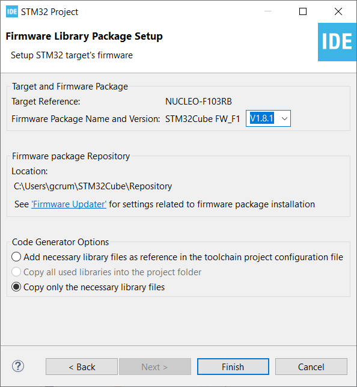

-   Click `Yes` to initialize all peripherals with their default mode

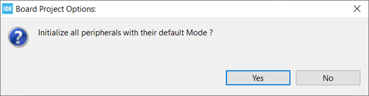

-   Click “Yes” to open the Device Configuration Tool perspective

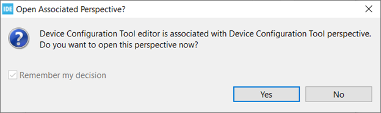

Your STM32CubeIDE should now look similar to the image below.

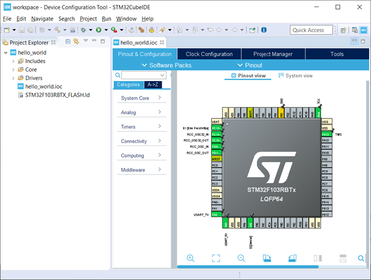

We are now going to change a few of the Project Code Generator settings.
We are going to change the generator so that it creates a pair of
‘.c/.h’ file per peripheral. Without this change, the `main.c` file is
overloaded with a lot of peripheral setup code.

-   Click “Project Manager”

-   Click “Code Generator”

-   Check “Generate peripheral initialization as a pair of ‘.c/.h’ file
    per peripheral”

There is an option for “Backup previously generated files when
re-generating” - however it does not seem to work

Your screen should look similar to the image below.

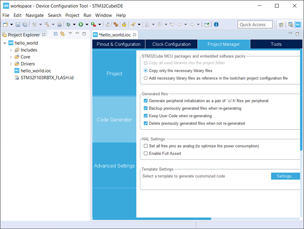

-   Press `Ctrl-S` to save the configuration file (alternatively you can
    Click File→Save)

-   Click `Yes` to generate the Code

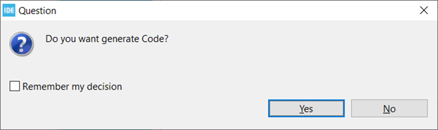

-   Click `Yes` to enter the C/C++ perspective

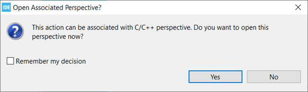

Your screen should now look similar to the image below.

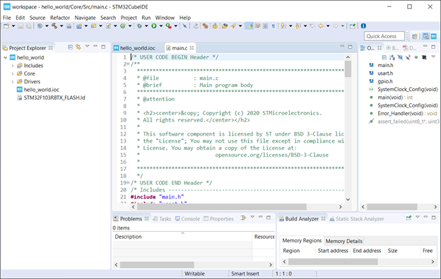

This is a good place to commit your code. It’s all auto-generate code
and by committing it now you can easily see what you might have
changed/added compared to the auto-generate content.

*Anytime you make a change using the Device Configuration Tool, we
recommend you commit the changes. This will make is easier to see your
changes vs auto generated coded changes.*

### Hardware and the HAL API

Looking at the NUCLEO-F103RB Schematic we see that GPIO Port A Pin 5 (PA5) is connected to the LED. Writing a 1 to the output pin (also called "pulling up" the pin) will cause the light to come on.

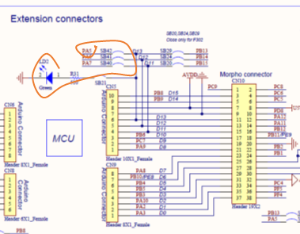

Since we also used the NUCLEO-F103RB Board Template and Initialized to
the defaults STM32CubeIDE also defined `LD2 [Green LED]` on Pin PA5.
When you open the `hello_world.ioc` file with the Device Configuration
Perspective you can see the pin labeled similar to the image below.

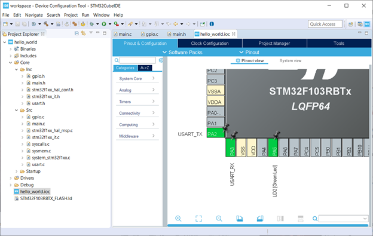

The tool will also create the some helper definitions for you. Open the `main.h` file and you will see the following lines.

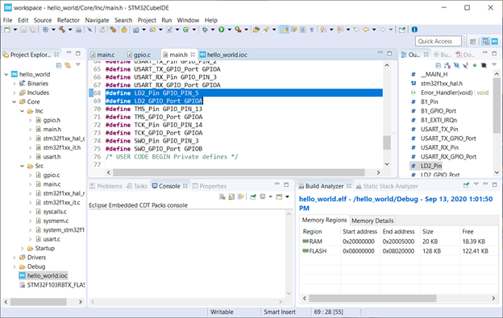

This is convenient however if you were to fully embrace this workflow
then you would need to label every pin and I find it easier to manually
create pin definitions. This allows me to add comments about the pin
definitions. Either way is acceptable in this class.

We see `GPIO_PIN_5` and `GPIOA`, but what are they and where are those
defined and what are they?

```
#define LD2_Pin GPIO_PIN_5
#define LD2_GPIO_Port GPIOA
``` 

Hold down ‘Ctrl’ and Left Click on `GPIO_PIN_5` and we see that it is a
bit-mask with bit index 5 containing a `1` (ie, 0000000000100000b):

```
#define GPIO_PIN_5 ((uint16_t)0x0020) /* Pin 5 selected */
```

Let us look closer at the `GPIOA` definition.

-   Hold down ‘Ctrl’ and Left Click on `GPIOA`.

This should bring you to the `stm32f103xb.h` file and you should see the
following:

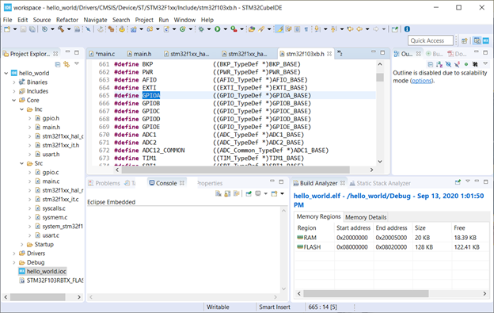

It looks like this device has five ports (A, B, C, D and E). They are
all pointers to a memory location (GPIOA\_BASE, GPIOB\_Base, etc) and
are all of type `GPIO_TypeDef`.

```
#define GPIOA ((GPIO_TypeDef *)GPIOA_BASE)
#define GPIOB ((GPIO_TypeDef *)GPIOB_BASE)
#define GPIOC ((GPIO_TypeDef *)GPIOC_BASE)
#define GPIOD ((GPIO_TypeDef *)GPIOD_BASE)
#define GPIOE ((GPIO_TypeDef *)GPIOE_BASE)
```

Looking around the same file, we can see all the addresses defined

```
#define PERIPH_BASE           0x40000000UL /*!< Peripheral base address in the alias region */
#define APB2PERIPH_BASE       (PERIPH_BASE + 0x00010000UL)
#define GPIOA_BASE            (APB2PERIPH_BASE + 0x00000800UL)
```

Therefore, it looks like `GPIOA=_BASE` is located at 0x40010800UL (i.e.
0x40000000UL + 0x00010000UL + 0x00000800UL) If you compare that to
[RM0008 Table 3](media/stm32f10xxx.pdf), we see that this value does line up with the data sheet.

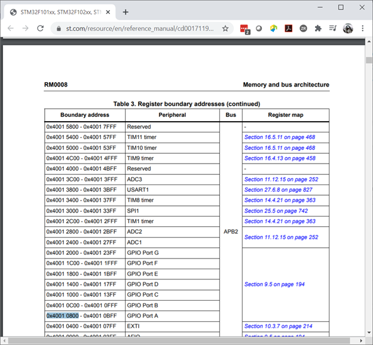

In the same file, we can see the definition of GPIO\_TypeDef. We see
that it is the register map of a General Purpose I/O Peripheral.

Looking at `RM0008` Section 9.5 Table 59 “GPIO Register map and reset
values”. We can see that the `GPIO_TypeDef` structure represents the
register map for the GPIO peripherals. If we overlay this structure on
top of the memory at the base address for the GPIO peripheral we can
easily get to the correct offset of any register in the peripheral and
read or write any of its control and status bits. This is the core
method for how the HAL drivers work. For each peripheral, HAL defines a
structure to map the control/status registers so that they are easy to
access by the low-level drivers.

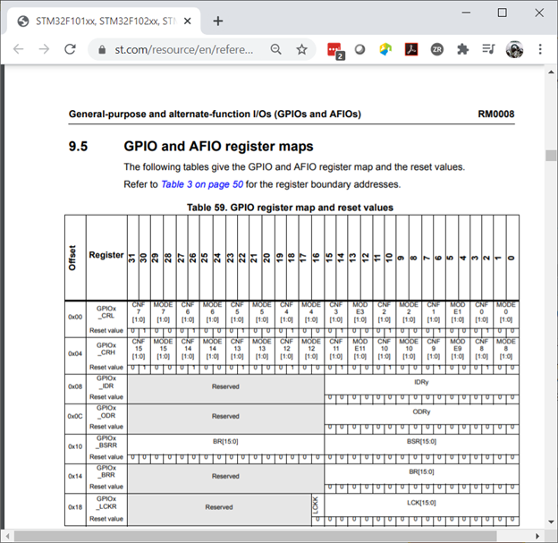

From the “UM1850 Description of STM32F1 HAL and low-layer drivers”
Section “20.2.4 IO operation functions” we see there is a
`HAL_GPIO_WritePin` function.

TIP – STM32CubeIDE/Eclipse has a great Code Completion feature. Type
“HAL\_” then press “Ctrl-Space” and a drop-down menu of known keywords
available from the source code and API. You can continue typing to get
closer to what you are looking for. Now continue typing so you have
“HAL\_GPIO” then you can use the Up/Down Arrows to select the desired
word and press “Enter”

In the main while loop, enter \`HAL\_GPIO\_WritePin\`

Ctrl Right Click on ‘HAL\_GPIO\_WritePin\` and you will just to the
function definition and see the the Doxygen formatted function comment
found in the source code. 

```
/**
  * @brief  Sets or clears the selected data port bit.
  *
  * @note   This function uses GPIOx_BSRR register to allow atomic read/modify
  *         accesses. In this way, there is no risk of an IRQ occurring between
  *         the read and the modify access.
  *
  * @param  GPIOx: where x can be (A..G depending on device used) to select the GPIO peripheral
  * @param  GPIO_Pin: specifies the port bit to be written.
  *          This parameter can be one of GPIO_PIN_x where x can be (0..15).
  * @param  PinState: specifies the value to be written to the selected bit.
  *          This parameter can be one of the GPIO_PinState enum values:
  *            @arg GPIO_PIN_RESET: to clear the port pin
  *            @arg GPIO_PIN_SET: to set the port pin
  * @retval None
  */
void HAL_GPIO_WritePin(GPIO_TypeDef *GPIOx, uint16_t GPIO_Pin, GPIO_PinState PinState)
```

From this, we see this function needs the GPIO\_TypeDef Port and GPIO
Pin arguments that we explored earlier.

Looking at the the “UM1850 Description of STM32F1 HAL and low-layer
drivers” Section “6 HAL System Driver” we see there is a `HAL_Delay`
function. This function has an uint32\_t argument for the minimum number
of milliseconds to delay.

The code snippet in `main.c` should look like:

```
/* Infinite loop */
  /* USER CODE BEGIN WHILE */
  while (1)
  {
    /* USER CODE END WHILE */
	   HAL_GPIO_WritePin(GPIOA, GPIO_PIN_5, GPIO_PIN_SET);
	   HAL_Delay(1000);
	   HAL_GPIO_WritePin(GPIOA, GPIO_PIN_5, GPIO_PIN_RESET);
	   HAL_Delay(1000);
    /* USER CODE BEGIN 3 */
  }
  /* USER CODE END 3 */
```

Now you should be able to follow the directions below and watch the code
run through the debugger.

### Debugging and Running With QEMU

-   Select Run→Debug Configurations…

-   Double Click on `GDB QEMU Debugging`

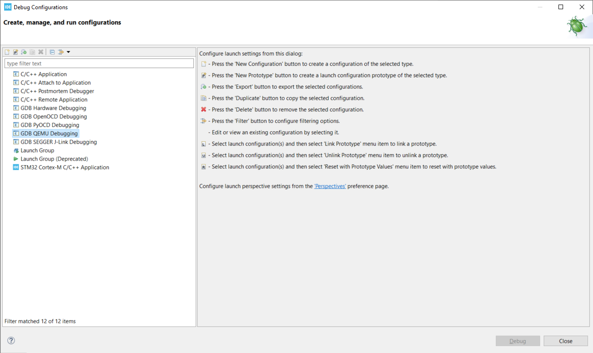

You should now see a screen similar to the one below.

If `Project` is not filed in with `hello_world` then you didn’t have the
project selected when you launched the Debug Configuration menu. You can
Click `Browse...` to correct this.

If `C/C++ Application` is not filled in with `Debug\hello_world.elf`,
then the project was not built when you launched the Debug Configuration
menu. You will need to exit the Debug Configuration area and build the
project. You can then click `Search Project...` to fine the executable
`Debug\hello_world.elf`

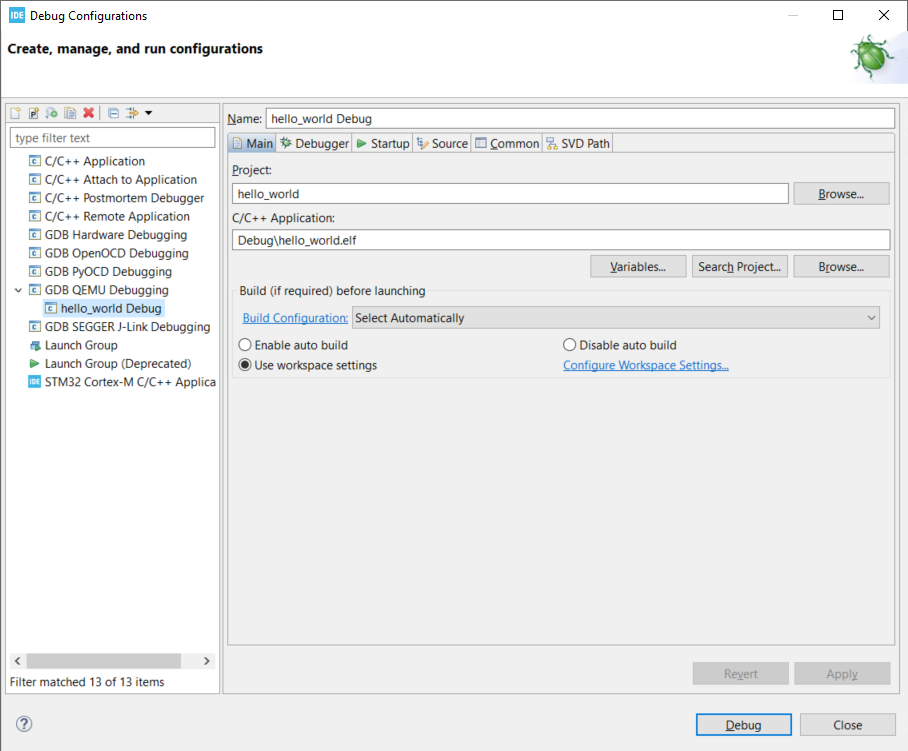

-   Click on the `Debugger` tab

-   In the `Board name:` area enter `NUCLEO-F103RB`

-   In the `Device name:` area enterh `STM32F103RB`

Your screen should look similar the image below.

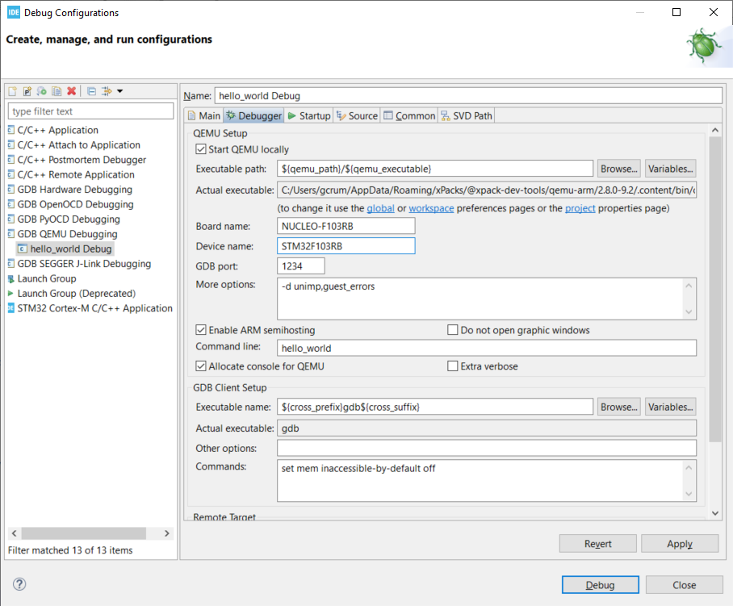

**Fixing the GDB Path Bug**

Look at the `Actual Executable` entry in the above image. It is simply
set to `gdb` instead of the full path and executable name. This is
because the `` ${cross_prefix} `` and `${cross_suffix}` eclipse
environment variables do not exist.

-   In `Executable name` enter
    `${gnu_tools_for_stm32_compiler_path}\arm-none-eabi-gdb`
    - For *nix based systems, enter `${gnu_tools_for_stm32_compiler_path}/arm-none-eabi-gdb`

**NOTE**:  For my Mac, I had to specify and hardcode the path to the debugger.

This will tell STM32CubeIDE to use the GDB installed with the
STM32CubeIDE.

When targeting the actual hardware and not QEMU this bug fix is not
needed

Your screen should now look similar to the image below. You can see that
the `Actual executable` is filled in.

-   Click `Debug` to run your application

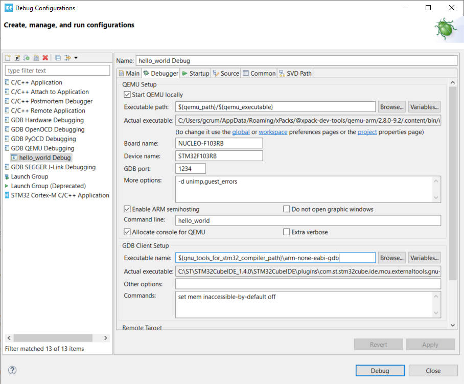

If you do not specify the board name and device name and try to run it,
you will get Console printout with a list of board and device names
supported

If all goes well, you will see an image of the NUCLEO-F103RB board
displayed.

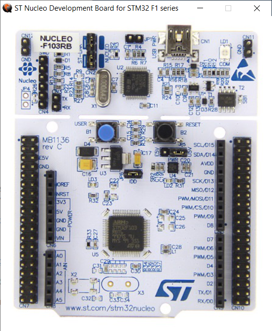

You will be prompted to switch to the Debug Perspective.

-   Click `Switch`

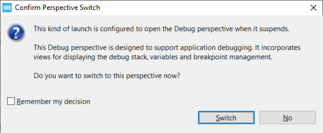

You will now enter the Debug Perspective and the debugger will be
suspended at the first instruction in main.

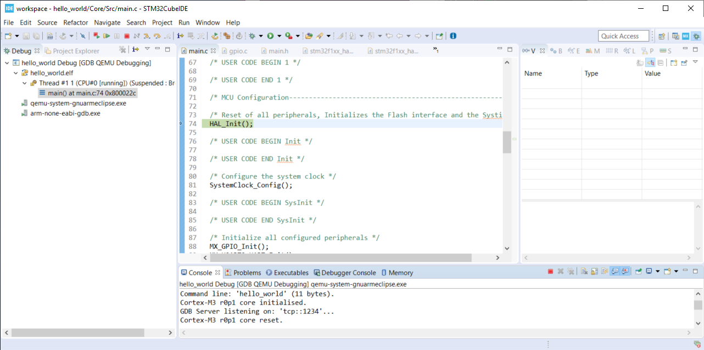

-   Repeatedly click `F6` to step over the code

-   After you execute the first `HAL_GPIO_WritePin` line go back to the
    NUCLEO-F103RB graphic window.


-   Press `F8` to resume the program

-   Go back to the NUCLEO-F103RB graphic window - you should see the LED
    blinking

The program will continue in this infinite loop until you press
`Ctrl-F2` (or the Stop Icon).

This is a good place to commit your code.

### User Control of the LED

If this example we will use a Button connected to the GPIO Pin to
control the LED.

In the same workspace, create a project named `user_input` and target
the same `NUCLEO-F103RB` board used in the `Hello World - Das Blinky`
section.

From the schematic, we can see the Blue Button (B1) is connected to Port
C, Pin 13 (PC13). There is a weak pull-up resistor connect on the GPIO
Input side of the button and the other side is connected to ground. This
results in the GPIO Pin reading a logic *1* when the button is **not
pressed** and a logic *0* when the button **is pressed**.

We can also see a RC filter across the button. This should prevent
bounce on the GPIO signal by filtering out the rapid mechanical
movements of the switch contacts until they settle.

A common design pattern to handle button de-bounce in software is to
monitor it over a small period and detect when it has become stable
after some time. The same logic can be used to determine between a long
or short press on a button. See the optional de-bounce article in the
Module 3 reading.

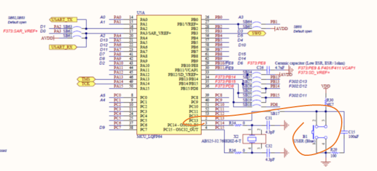

Looking at the `main.h` file we can see they made some definitions that
we can use.

```
#define B1_Pin GPIO_PIN_13
#define B1_GPIO_Port GPIOC
```

From the “UM1850 Description of STM32F1 HAL and low-layer drivers”
Section “20.2.4 IO operation functions” we see there is a
`HAL_GPIO_ReadPin` function.

Remember you can type `HAL_GPIO_` and press `Ctrl-Space` add see all of
the functions associated with the HAL GPIO Driver and then
Ctrl-LeftClick to jump to their function definitions to better
understand now to use them.

We can see the `HAL_GPIO_ReadPin` has similar arguments as the
`HAL_GPIO_WritePin`

```
/**
  * @brief  Reads the specified input port pin.
  * @param  GPIOx: where x can be (A..G depending on device used) to select the GPIO peripheral
  * @param  GPIO_Pin: specifies the port bit to read.
  *         This parameter can be GPIO_PIN_x where x can be (0..15).
  * @retval The input port pin value.
  */
GPIO_PinState HAL_GPIO_ReadPin(GPIO_TypeDef *GPIOx, uint16_t GPIO_Pin)
```

-   Use `HAL_GPIO_ReadPin` and `HAL_GPIO_WritePin` to turn **ON** the
    LED when the Button is **PRESSED**

There is a bug in the QEMU model that defaults the Button to logic *0*
on startup. After you pressed the button once, it will behave properly.

My code, which is designed to ignore the QEMU bug, looks like this:

```
int main(void)
{
  /* USER CODE BEGIN 1 */

  /* USER CODE END 1 */

  /* MCU Configuration--------------------------------------------------------*/

  /* Reset of all peripherals, Initializes the Flash interface and the Systick. */
  HAL_Init();

  /* USER CODE BEGIN Init */

  /* USER CODE END Init */

  /* Configure the system clock */
  SystemClock_Config();

  /* USER CODE BEGIN SysInit */

  /* USER CODE END SysInit */

  /* Initialize all configured peripherals */
  MX_GPIO_Init();
  MX_USART2_UART_Init();

  /* USER CODE BEGIN 2 */
  // QEMU debugger has a bug in the code that starts the blue button at RESET, rather than
  // SET when it is not pressed.  So, let's wait until the user presses the button, which effectively
  // ignores the first press
  while (HAL_GPIO_ReadPin(GPIOC, GPIO_PIN_13)==GPIO_PIN_RESET)
	  HAL_Delay(800);

  /* USER CODE END 2 */

  /* Infinite loop */
  /* USER CODE BEGIN WHILE */
  GPIO_PinState state = GPIO_PIN_RESET;
  while (1)
  {
    /* USER CODE END WHILE */
	// Now, let's watch for button to press to change states
	if (HAL_GPIO_ReadPin(GPIOC, GPIO_PIN_13) == GPIO_PIN_RESET)
	{
		HAL_Delay(800);
		if (state == GPIO_PIN_RESET)
			state = GPIO_PIN_SET;
		else
			state = GPIO_PIN_RESET;
	}
	HAL_GPIO_WritePin(GPIOA, GPIO_PIN_5, state);
    /* USER CODE BEGIN 3 */
  }
  /* USER CODE END 3 */
}
```

This is here as a reference to help guide you.

A lab report is required for this assignment, along with a simple flowchart or state diagram for the code you executed.
